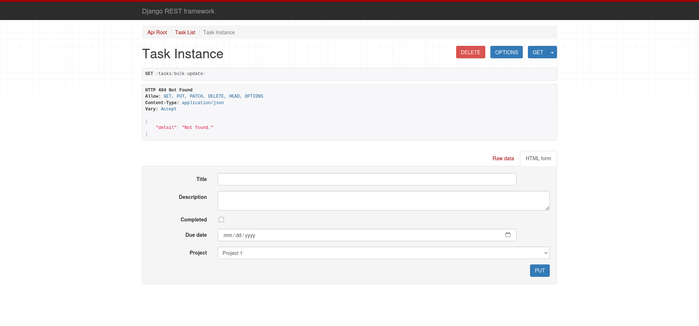
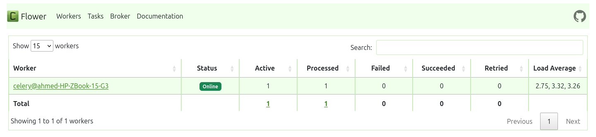

# SBO-Tasks: 
## Task Management System

A small Task Management System built using Django REST Framework, showcasing the following concepts:

- **Celery & Celery Beat**: For background and scheduled tasks.
- **Query Optimization**: Utilizing `select_related`, `prefetch_related`, and `annotate`.
- **Bulk Operations**: Implementing `bulk_create`, `bulk_update`, and `bulk_delete`.



---

### 📚 API Endpoints

The application provides a set of RESTful API endpoints for managing projects and tasks. Below is a summary of the key endpoints:

#### **Projects**: Manage project entities.
- `GET /projects/`: Retrieve a list of all projects.
- `POST /projects/`: Create a new project.
- `GET /projects/{id}/`: Retrieve details of a specific project.
- `PUT /projects/{id}/`: Update a specific project.
- `DELETE /projects/{id}/`: Delete a specific project.

#### **Tasks**: Manage task entities.
- `GET /tasks/`: Retrieve a list of all tasks.
- `POST /tasks/`: Create a new task.
- `GET /tasks/{id}/`: Retrieve details of a specific task.
- `PUT /tasks/{id}/`: Update a specific task.
- `DELETE /tasks/{id}/`: Delete a specific task.

#### **Bulk Operations**: Perform bulk actions on tasks.
- `POST /tasks/bulk-create/`: Create multiple tasks in a single request.
- `PUT /tasks/bulk-update/`: Update multiple tasks in a single request.
- `DELETE /tasks/bulk-delete/`: Delete multiple tasks in a single request.

These endpoints are designed to streamline task and project management, making it easier to integrate with other systems or automate workflows.

---

### 🛠️ Example Curl Commands for Project Endpoints

Here are some example `curl` commands for interacting with the project endpoints:

- **Retrieve all projects**:
    ```bash
    curl -X GET http://127.0.0.1:8000/projects/
    ```

- **Create a new project**:
    ```bash
    curl -X POST http://127.0.0.1:8000/projects/ \
    -H "Content-Type: application/json" \
    -d '{"name": "New Project", "description": "Project description"}'
    ```

- **Retrieve a specific project**:
    ```bash
    curl -X GET http://127.0.0.1:8000/projects/{id}/
    ```

- **Update a specific project**:
    ```bash
    curl -X PUT http://127.0.0.1:8000/projects/{id}/ \
    -H "Content-Type: application/json" \
    -d '{"name": "Updated Project Name", "description": "Updated description"}'
    ```

- **Delete a specific project**:
    ```bash
    curl -X DELETE http://127.0.0.1:8000/projects/{id}/
    ```

---

### 🚀 Setup

Follow these steps to set up the project:

```bash
mkdir SBO-Tasks
cd SBO-Tasks
git clone https://github.com/AhmedHashim04/SBO-Tasks.git src
cd src
python -m venv .
source venv/bin/activate
pip install -r requirements.txt
python manage.py migrate
python manage.py createsuperuser
python manage.py runserver

celery -A project worker -l info
celery -A project beat -l info
celery -A project flower --port=5555
```


